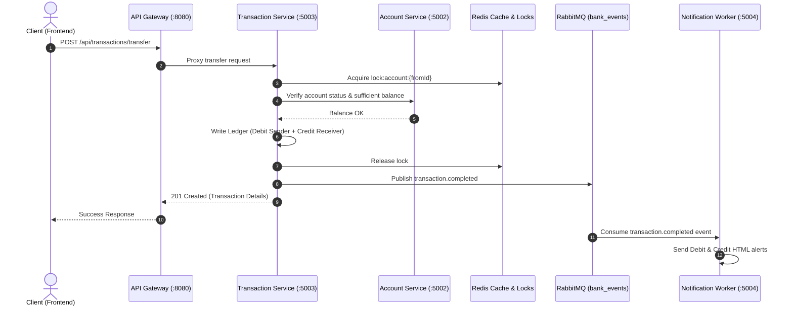

# 🏦 Nexus Bank — Distributed Banking & Double-Entry Ledger System

[](https://nodejs.org)
[](https://expressjs.com)
[](https://www.mongodb.com)
[](https://redis.io)
[](https://www.rabbitmq.com)
[](https://react.dev)
[](https://vitejs.dev)
[](https://tailwindcss.com)

> An enterprise-grade, event-driven microservices banking platform featuring strict **ACID double-entry ledger bookkeeping**, distributed concurrency locking, asynchronous message queues with Dead-Letter handling, and modern reactive client dashboards.

---

## 📑 Table of Contents

- [Architectural Overview](#-architectural-overview)
- [Microservices Breakdown](#-microservices-breakdown)
- [Key Engineering Highlights](#-key-engineering-highlights)
- [System Architecture Flow](#-system-architecture-flow)
- [Tech Stack](#-tech-stack)
- [Repository Structure](#-repository-structure)
- [Getting Started](#-getting-started)
  - [Prerequisites](#prerequisites)
  - [Environment Configuration](#environment-configuration)
  - [Installation & Local Run](#installation--local-run)
- [API Reference](#-api-reference)
- [Security & Invariants](#-security--invariants)
- [License](#-license)

---

## 🏗 Architectural Overview

Nexus Bank is structured around domain-driven, independently deployable microservices orchestrated via an API Gateway and decoupled through RabbitMQ message broker.

```
                         ┌─────────────────────────┐
                         │   Client (React Vite)   │
                         └────────────┬────────────┘
                                      │ HTTP / REST
                                      ▼
                         ┌─────────────────────────┐
                         │    API Gateway (:8080)  │
                         └──────┬──────┬─────┬─────┘
                                │      │     │
            ┌───────────────────┘      │     └───────────────────┐
            ▼                          ▼                         ▼
┌───────────────────────┐  ┌──────────────────────┐  ┌───────────────────────┐
│  Auth Service (:5001) │  │Account Service(:5002)│  │Transaction Svc (:5003)│
└───────────┬───────────┘  └──────────┬───────────┘  └───────────┬───────────┘
            │                         │                          │
            ├───────────────┐         │                          │
            ▼               ▼         ▼                          ▼
      ┌───────────┐   ┌──────────────────────────────────────────────┐
      │Redis (OTP)│   │          Database Per Service (MongoDB)      │
      └───────────┘   │    (bank_auth, bank_account, bank_tx)        │
                      └──────────────────────┬───────────────────────┘
                                             │
                                             ▼
                      ┌──────────────────────────────────────────────┐
                      │        RabbitMQ Exchange: bank_events        │
                      └──────────────────────┬───────────────────────┘
                                             │
                        ┌────────────────────┴────────────────────┐
                        │ (auth.*, transaction.*)                 │
                        ▼                                         ▼
            ┌───────────────────────┐                 ┌───────────────────────┐
            │ Notification (:5004)  │                 │    Mail Retry / DLQ   │
            │ (Nodemailer Worker)   │                 │ (Dead-Letter Queue)   │
            └───────────────────────┘                 └───────────────────────┘
```

---

## 🧩 Microservices Breakdown

| Service | Port | Description | Database / Store |
| :--- | :---: | :--- | :--- |
| **API Gateway** | `8080` | Reverse proxy and central dispatch for microservices routing, request normalization, and CORS handling. | Stateless |
| **Auth Service** | `5001` | User registration, authentication, JWT issuing with HTTP-only cookies, Redis-powered 6-digit OTP verification with TTL. | MongoDB (`bank_auth`) + Redis |
| **Account Service** | `5002` | Bank account creation, account number generation, status lifecycle, and inter-service balance checks. | MongoDB (`bank_account`) |
| **Transaction Service** | `5003` | ACID double-entry ledger bookkeeping, debit/credit ledger records, distributed Redis lock protection, idempotency enforcement. | MongoDB (`bank_transaction`) + Redis |
| **Notification Service** | `5004` | Event consumer listening to `bank_events`, asynchronous HTML email delivery (Welcome, OTP, Transaction alerts) with retry/DLQ backoff. | RabbitMQ (`mail_queue`) |
| **Frontend App** | `5173` | React 18 single-page application with Tailwind CSS, real-time feedback, transfer wizards, and ledger explorer. | Client Browser |

---

## ⚡ Key Engineering Highlights

### 1. ⚖️ Strict Double-Entry Ledger Bookkeeping
Every transaction generates balanced debit and credit entries inside an atomic database session:
$$\sum \text{Debits} = \sum \text{Credits}$$
Financial balances are verified against immutable ledger records to eliminate race conditions and currency creation bugs.

### 2. 🔒 Distributed Concurrency Locks (Redis)
To prevent double-spending when multiple concurrent requests attempt transfers from the same account, a distributed Redis lock (`lock:account:<id>`) is acquired prior to fund debiting and released in a `finally` block.

### 3. 📬 Asynchronous Event-Driven Messaging
Domain events (`auth.user.registered`, `auth.otp.requested`, `transaction.completed`, `transaction.failed`) are published to RabbitMQ. The Notification Service consumes messages without blocking the user-facing request pipeline.

### 4. 🛡️ Dead Letter Queue (DLQ) & Exponential Retries
Failed mail deliveries are routed to a `mail_retry_queue` with a time-to-live (`x-message-ttl`), then dead-lettered back to `mail_queue` up to `MAX_ATTEMPTS` before being sent to `mail_dlq` for inspection.

---

## 🔄 System Architecture Flow



---

## 💻 Tech Stack

- **Backend Runtime**: [Node.js](https://nodejs.org/) (ES Modules)
- **Framework**: [Express 5](https://expressjs.com/)
- **Monorepo Workspaces**: npm workspaces (`services/*`, `shared`)
- **Primary Databases**: [MongoDB Atlas](https://www.mongodb.com/atlas) with Mongoose ODM
- **In-Memory Store**: [Redis](https://redis.io/) (Upstash / local Redis)
- **Message Broker**: [RabbitMQ](https://www.rabbitmq.com/) (CloudAMQP / local AMQP)
- **Email Service**: [Nodemailer](https://nodemailer.com/) (Gmail OAuth2 & App Passwords)
- **Frontend Framework**: [React 18](https://react.dev/) + [Vite](https://vitejs.dev/)
- **Styling**: [Tailwind CSS](https://tailwindcss.com/) + Lucide Icons
- **Tooling**: Nodemon, Concurrently, Postman

---

## 📂 Repository Structure

```
Banking-Transaction-Ledger-App/
├── .gitignore
├── .env.example
├── package.json                   # Root monorepo workspace configuration
├── README.md                      # Comprehensive project documentation
│
├── backend/
│   ├── .env.example               # Backend environment template
│   ├── package.json               # Backend npm workspace orchestrator
│   │
│   ├── services/
│   │   ├── gateway/               # Reverse proxy on :8080
│   │   ├── auth-service/          # Auth, JWT, OTP on :5001
│   │   ├── account-service/       # Account creation & balances on :5002
│   │   ├── transaction-service/   # Double-entry ledger on :5003
│   │   └── notification-service/  # RabbitMQ email consumer on :5004
│   │
│   └── shared/                    # Monorepo shared library (@bank/shared)
│       └── src/
│           ├── errors/            # ApiError class
│           ├── events/            # RabbitMQ event bus & event types
│           ├── middlewares/       # Auth, error & correlation middlewares
│           └── utils/             # ApiResponse, asyncHandler, Redis locks
│
└── frontend/                      # Client Application (React + Vite)
    ├── package.json
    ├── vite.config.js
    ├── index.html
    └── src/
        ├── components/            # Reusable UI widgets
        ├── pages/                 # Dashboard, Login, Transfer, Accounts
        └── services/              # Axios API client integrations
```

---

## 🚀 Getting Started

### Prerequisites

Ensure you have installed:
- [Node.js](https://nodejs.org/) `>= 20.x`
- [npm](https://www.npmjs.com/) `>= 9.x`
- Running instance of **MongoDB** (local or MongoDB Atlas)
- Running instance of **Redis** (local or Upstash)
- Running instance of **RabbitMQ** (local or CloudAMQP)

---

### Environment Configuration

Create a `.env` file in the `backend/` directory by copying the example:

```bash
cp backend/.env.example backend/.env
```

Populate the required configuration variables:

```env
# Service Ports
GATEWAY_PORT=8080
AUTH_SERVICE_PORT=5001
ACCOUNT_SERVICE_PORT=5002
TRANSACTION_SERVICE_PORT=5003
NOTIFICATION_SERVICE_PORT=5004

# Inter-Service Communication
AUTH_SERVICE_URL=http://localhost:5001
ACCOUNT_SERVICE_URL=http://localhost:5002
TRANSACTION_SERVICE_URL=http://localhost:5003

# Databases (MongoDB)
MONGODB_URI=mongodb+srv://<username>:<password>@cluster0.mongodb.net
AUTH_DB_NAME=bank_auth
ACCOUNT_DB_NAME=bank_account
TRANSACTION_DB_NAME=bank_transaction

# Message Broker & Cache
REDIS_URI=redis://localhost:6379
RABBITMQ_URI=amqp://localhost:5672

# Security
JWT_SECRET=your_super_secret_jwt_key
OTP_TTL_SECONDS=300
OTP_MAX_ATTEMPTS=5

# Notification Credentials (Gmail App Password or OAuth2)
EMAIL_USER=your_email@gmail.com
EMAIL_PASS=your_16_digit_app_password
# OR OAuth2:
CLIENT_ID=your_client_id
CLIENT_SECRET=your_client_secret
REFRESH_TOKEN=your_refresh_token
```

---

### Installation & Local Run

#### 1. Install Dependencies
From the repository root:
```bash
# Install backend monorepo dependencies
npm --prefix backend install

# Install frontend dependencies
npm --prefix frontend install

# Install root dependencies
npm install
```

#### 2. Run All Services Concurrently
Start the entire ecosystem (all 5 microservices + frontend) with a single command:

```bash
npm run dev
```

Alternatively, run backend microservices and frontend in separate terminals:

```bash
# Terminal 1 - Backend microservices
npm --prefix backend run dev

# Terminal 2 - Frontend application
npm --prefix frontend run dev
```

| Service | URL |
| :--- | :--- |
| **Frontend Web App** | [http://localhost:5173](http://localhost:5173) |
| **API Gateway** | [http://localhost:8080](http://localhost:8080) |
| **Gateway Health** | [http://localhost:8080/health](http://localhost:8080/health) |

---

## 📡 API Reference

All requests route through the **API Gateway** (`http://localhost:8080`).

### Authentication (`/api/auth`)
| Method | Endpoint | Description | Auth Required |
| :--- | :--- | :--- | :---: |
| `POST` | `/api/auth/register` | Register a new user | No |
| `POST` | `/api/auth/login` | Login user & trigger OTP email | No |
| `POST` | `/api/auth/verify-otp` | Verify 6-digit OTP & receive JWT | No |
| `GET` | `/api/auth/profile` | Retrieve authenticated profile | Yes |

### Bank Accounts (`/api/accounts`)
| Method | Endpoint | Description | Auth Required |
| :--- | :--- | :--- | :---: |
| `POST` | `/api/accounts` | Open a new bank account | Yes |
| `GET` | `/api/accounts/my` | List current user's accounts | Yes |
| `GET` | `/api/accounts/:id` | Get account details & balance | Yes |

### Transactions & Ledger (`/api/transactions`)
| Method | Endpoint | Description | Auth Required |
| :--- | :--- | :--- | :---: |
| `POST` | `/api/transactions/deposit` | Initial funds deposit (Credit) | Yes |
| `POST` | `/api/transactions/transfer` | Double-entry inter-account transfer | Yes |
| `GET` | `/api/transactions/history/:accountId` | Ledger history with audit trail | Yes |

---

## 🔐 Security & Invariants

- **HTTP-Only Cookies**: JWT tokens stored securely to safeguard against XSS attacks.
- **Strict Ledger Invariant**: Balance updates are prohibited outside validated debit/credit ledger records.
- **Race Condition Immunity**: Distributed Redis locks prevent double-spend exploit vectors during high concurrency.
- **Secrets Protection**: All `.env` and `plan.md` files are strictly git-ignored; production secrets are provisioned directly in GitHub Repository Secrets.

---

## 📄 License

This project is licensed under the [ISC License](LICENSE).
